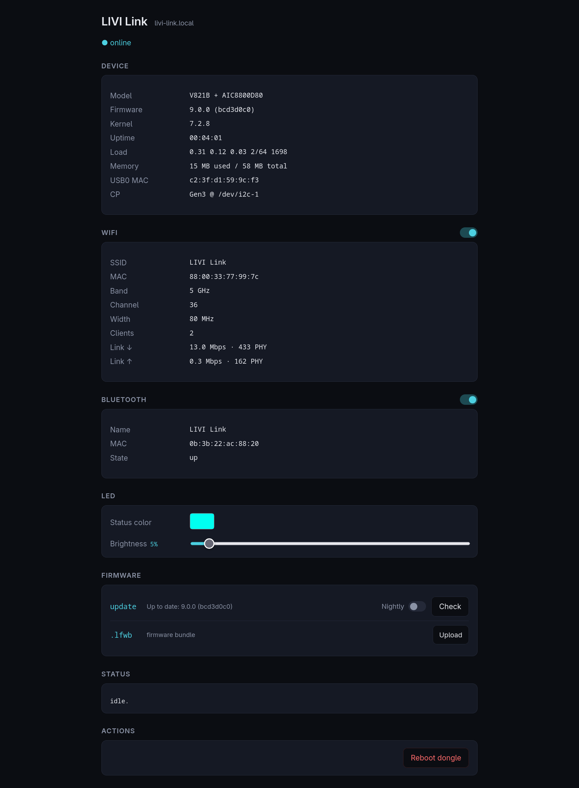

# LIVI Link

A CarPlay dongle, reflashed into a network accessory for LIVI's native CarPlay stack. It is
supported on Linux and macOS, and can provide:

- **MFi authentication** over the network
- **A Wi-Fi access point**
- **Bluetooth** as a vhci on Linux and on macOS the dongle pairs the phone

Each one is enabled separately in the settings. While the dongle is not selected in the settings,
LIVI turns its access point temporarily off to keep interference low.

## Firmware

The provisioning tool probes for the required firmware.

| Firmware | SoC | Wi-Fi / Bluetooth | Wi-Fi | PHY rate | Kernel |
| --- | --- | --- | --- | --- | --- |
| `imx6ul_iw416` | NXP i.MX6UL | NXP IW416 | Wi-Fi 4, 1x1, 5 GHz, 40 MHz | 150 Mbit/s | 7.2.9 |
| `imx6ul_rtl8822cs` | NXP i.MX6UL | RTL8822CS | Wi-Fi 5, 2x2, 5 GHz, 80 MHz | 867 Mbit/s | 7.2.9 |
| `imx6ul_rtl8822bs`[^nobt] | NXP i.MX6UL | RTL8822BS | Wi-Fi 5, 2x2, 5 GHz, 80 MHz | 867 Mbit/s | 7.2.9 |
| `v821b_aic8800d80` | Allwinner V821B | AIC8800D80 | Wi-Fi 6, 1x1, 5 GHz, 80 MHz | 600 Mbit/s | 7.2.9 |
| `ax520_aic8800d80` | Axera AX520CE | AIC8800D80 | Wi-Fi 6, 1x1, 5 GHz, 80 MHz | 600 Mbit/s | 7.2.9 |

[^nobt]: Wi-Fi only, the module's Bluetooth is not supported yet.

## Setup

Flashing a dongle is at your own risk. If something goes wrong, open an [issue](https://github.com/f-io/LIVI/issues).

Download `livi-link-provision` for your platform from the release page, then with the dongle plugged in (with some dongles you also need to be on their Wi-Fi):

```bash
chmod +x livi-link-provision
./livi-link-provision
```

macOS quarantines downloads, so run this first:

```bash
xattr -d com.apple.quarantine livi-link-provision
```

A backup is taken before anything is written and saved to
`~/Library/Application Support/LIVI/backup/dongle-backup/` on macOS, or
`~/.local/share/LIVI/dongle-backup/` on Linux.

Some i.MX6UL with older kernels offer no network over USB on their vendor firmware. The tool notices that after the replug and asks you to join the dongle's Wi-Fi instead (default password).

## Web interface

<http://livi-link.local/>, or <http://10.10.10.1/> over USB or Wi-Fi.

<p align="center">
  
</p>

## Updating

Under **Firmware**, **Check** looks for a newer version and **Update** installs it. With **Nightly** on it checks the nightly builds instead of the latest release. Do not unplug the dongle while it writes. Some dongles restarts twice when an update brings a new kernel.

Every release has the firmware files attached, so you can also upload one by hand.

## LED

If the dongle has an LED, Wi-Fi uses the status LED and Bluetooth is blue.

| State | LED |
| --- | --- |
| Waiting for a Wi-Fi client | status LED blinks |
| Wi-Fi client connected | status LED on |
| Bluetooth paging | blue blinks |
| Bluetooth connected | blue on |
| Writing firmware | red and blue alternate |

## Getting back to stock

With the `v821b_aic8800d80` or `ax520_aic8800d80` firmware, upload the backup the install made
(`v821b_stock_<date>.lfwb` or `ax520_stock_<date>.lfwb`) on the web interface
under **Firmware**. The dongle writes it and reboots into its original firmware.

With an `imx6ul_…` firmware, run the provisioning tool on the computer
that did the install and pick **back to the vendor firmware**. It takes the backup, writes it back from the rescue system and restarts into the original firmware.

## If something goes wrong

If the dongle does not come up on USB or Wi-Fi, give it 30 seconds, then replug it. A dongle whose system does not come up on first boot stays in a rescue system after the next restart.

 It is reachable over USB at `telnet 10.10.10.1` or `nc 10.10.10.1 23`. The logs are under `/tmp` on the dongle. The rescue system can take up to 15 s until the dongle is reachable via USB NCM.
